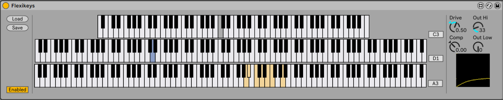

# flexikeys

Max for Live device for remapping notes, with support for randomization, key switching, and per-note velocity curves.

Explanation of the interface:

* `Load` and `Save` make it possible to load and save presets.
* The device can be in `Enabled` or `Passthru` mode.
  Passthru can be helpful when setting up the mappings, whilst sending the MIDI
  unmodified through to the audio device.
* The top keyboard displays the selected input note.
  Either use the mouse to select a key, or use a MIDI input device.
* The middle keyboard sets up an optional **per note keyswitch**.
  - If used, the keyswitch note is issued prior to the note itself.
  - If more than one keyswitch is selected, a random one is chosen; this can be
    useful for selecting a random articulation.
  - If no notes are selected, no keyswitch is emitted.
* The bottom keyboard is the **per note output**.
  - If more than one output note is selected, a random one is chosen.
  - If no notes are selected, no output is emitted (the note will be silent).
* Finally, we have a **per note velocity curve**.

